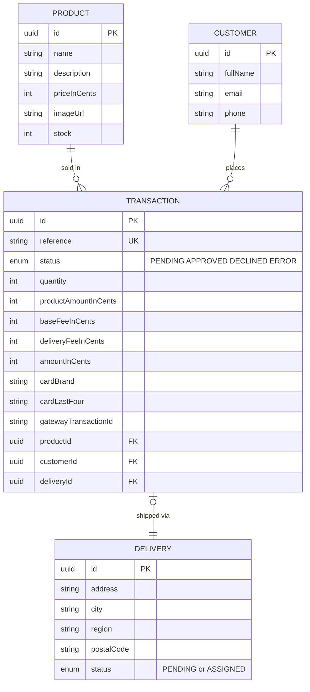

# Payment Gateway Product

A product checkout that charges a credit card through an external payment gateway.
The buyer picks a product, enters card and delivery information, reviews a summary,
and gets the final payment status while stock is updated on the server.

## Live demo

- **Frontend:** https://d2d709ahd163ox.cloudfront.net
- **API:** https://hucxabwnqn.us-east-1.awsapprunner.com
- **API documentation (Swagger):** https://hucxabwnqn.us-east-1.awsapprunner.com/docs

Use a sandbox test card such as `4242 4242 4242 4242`, any future expiry (e.g.
`08 / 30`) and any 3-digit CVC.

## Overview

An npm-workspaces monorepo:

```
apps/
  api/    NestJS API — hexagonal architecture, Railway Oriented use cases
  web/    React SPA — Vite, Redux Toolkit, mobile-first, refresh-resilient
infra/
  terraform/  Infrastructure as code (App Runner, RDS, S3, CloudFront)
docs/
  adr/    Architecture Decision Records
```

## Checkout flow

Five screens drive the process:

1. **Product** — available product, description, price and stock.
2. **Card & delivery** — validated card (VISA / Mastercard detection) and shipping data.
3. **Summary** — product amount, base fee (always applied) and delivery fee in a backdrop.
4. **Final status** — approved, declined or failed result.
5. **Product** — back to the store with the stock updated.

On the server, paying creates a `PENDING` transaction, calls the gateway, and —
in a single atomic unit of work — records the result, assigns the delivery and
decrements stock. The client flow is resilient: progress is persisted so a page
refresh resumes where the buyer left off, while raw card data is never persisted.

## Architecture

- **Hexagonal (Ports & Adapters):** business logic lives in the domain and
  application layers, never in controllers. [ADR 0002](docs/adr/0002-hexagonal-architecture.md)
- **Railway Oriented Programming:** use cases return a typed `Result` and
  short-circuit on the first expected failure. [ADR 0003](docs/adr/0003-railway-oriented-programming.md)
- **Payment provider behind a port:** the gateway is vendor-neutral and every
  secret (including the integrity signature) stays on the server.
  [ADR 0005](docs/adr/0005-payment-provider-abstraction.md)
- **Data model:** integer-cents money, card data reduced to brand + last four.
  [ADR 0004](docs/adr/0004-data-model.md)

Every decision is recorded in [docs/adr](docs/adr/README.md).

## Data model



Money is stored as integer cents. Card data is never persisted — only the brand
and the last four digits are kept for the receipt. A transaction consumes stock
and produces a delivery only when it is approved.
See [ADR 0004](docs/adr/0004-data-model.md).

## Tech stack

| Layer | Choice |
| --- | --- |
| API | NestJS 11, TypeScript (no `any`), Prisma, PostgreSQL |
| Web | React 19, Vite, Redux Toolkit, redux-persist |
| Tests | Jest (both apps) |
| Infra | Terraform, AWS App Runner + RDS + S3 + CloudFront |

## Getting started

Requirements: Node 20+, Docker, Terraform, AWS CLI.

```bash
npm install
```

Then follow [`apps/api/README.md`](apps/api/README.md) and
[`apps/web/README.md`](apps/web/README.md) to run each app locally.

## Testing

```bash
npm run test:cov
```

Coverage is enforced above 80% on both apps (Jest `coverageThreshold`).

| App | Statements | Branches | Functions | Lines |
| --- | --- | --- | --- | --- |
| api | 97.6% | 94.7% | 99.2% | 97.6% |
| web | 90.0% | 86.1% | 85.7% | 89.9% |

### SonarQube

Both applications pass the SonarQube quality gate.

| API | Web |
| --- | --- |
|  |  |

Each app has its own `sonar-project.properties`; run `npm run test:cov` first to
generate the coverage reports the scanner consumes.

## Security

- HTTPS end to end (CloudFront and App Runner).
- Security headers via Helmet, strict request validation, and CORS limited to the
  frontend origin.
- Sensitive data handling: card data is tokenized server-side and only the brand
  and last four digits are stored; the gateway integrity signature is computed on
  the server; secrets are injected as environment variables and never committed.

## Deployment

Infrastructure is provisioned with Terraform and deployed with a single script:

```bash
bash infra/scripts/deploy.sh
```

See [`infra/terraform/README.md`](infra/terraform/README.md) and
[ADR 0006](docs/adr/0006-deployment-topology.md).
